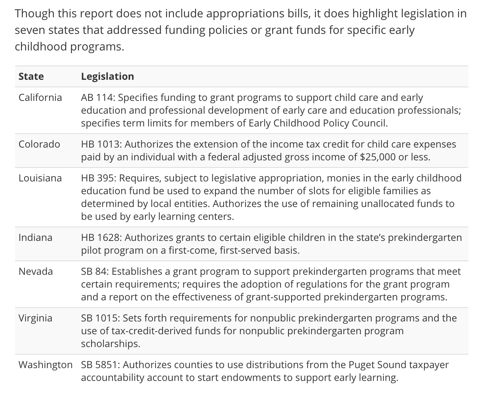
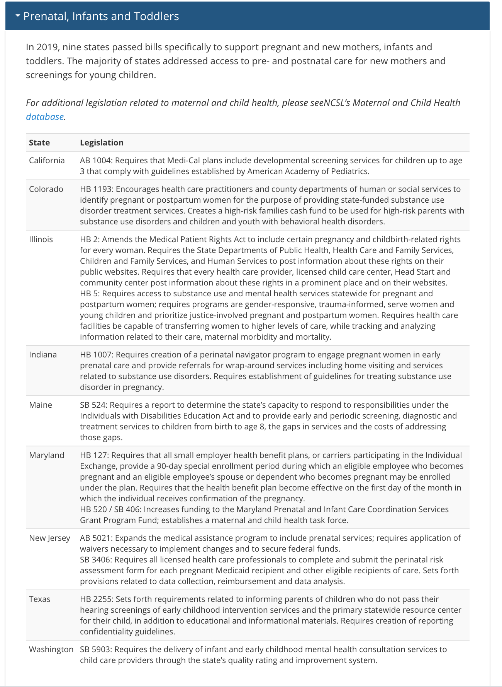

```{r state-policy-1, echo = F}
knitr::opts_chunk$set(echo = FALSE, 
                      warning = FALSE, 
                      message = FALSE, 
                      fig.width = 10)
options(knitr.kable.NA = '')
```

```{r state-policy-2 }
library(conflicted)
library(here)
library(ggpubr)
conflict_prefer("group_rows", "kableExtra")
conflict_prefer("select", "dplyr")
conflict_prefer("filter", "dplyr")
conflict_prefer("lag", "dplyr")
conflict_prefer("map", "purrr")
library(plotly)
```

```{r state-policy-3 }
source(here("Scripts/score data.R")) 
```

```{r state-policy-4 }
source(here("Functions/pomp.R"))
source(here("Functions/state_policy_fun.R"))
```

```{r state-policy-5 }
scored = scored %>%
  mutate_at(vars(anxiety, depress, lonely, stress), pomp) %>%
  rowwise() %>%
  mutate(mental_health = mean(c(anxiety, depress, lonely, stress), na.rm=T)) %>%
  mutate(material_hardship = sum(c_across(starts_with("diff_pay_")), na.rm=T)) %>%
  ungroup() %>%
 mutate(
   black_cat = factor(black, labels = c("non-Black", "Black")),
   poverty_cat = factor(poverty150, labels = c("High Income", "Low Income")),
   single_cat = factor(single, labels = c("Dual parent", "Single parent")),
   disability_cat = factor(disability, labels = c("No disability", "Child with disability")),
   race_ethnic = case_when(
     black == 1 ~ "Black",
     latinx == 1 ~ "LatinX",
     !is.na(black) ~ "White",
     !is.na(latinx) ~ "White",
     TRUE ~ NA_character_),
   race_poverty = case_when(
     black == 1 & poverty150 == 1 ~ "Low income, Black",
     black == 1 & poverty150 == 0 ~ "High income, Black",
     latinx == 1 & poverty150 == 1 ~ "Low income, LatinX",
     latinx == 1 & poverty150 == 0 ~ "High income, LatinX",
     white == 1 & poverty150 == 1 ~ "Low income, White",
     white == 1 & poverty150 == 0 ~ "High income, White",
     TRUE ~ NA_character_)) %>%
  mutate(material_hardship = ifelse(material_hardship > 0, 1, 0)) %>%
  mutate(Week = case_when(
    Week < 17 ~ Week, 
    (Week %% 2) == 0 ~ Week - 1,
    TRUE ~ Week)) %>%
  group_by(Week) %>%
  mutate(Date =case_when(
    Week == 0 ~ as.Date("2020-03-01"),
    TRUE ~ min(Date)
  ))
```


```{r state-policy-6 }
dates = scored %>%
  group_by(Week) %>%
  summarize(
    Date = min(Date)) %>%
  mutate(label = case_when(
    Week == 0 ~ "Pre Pandemic",
    TRUE ~ format(Date, "%b %d")
  ))
```


# Representativeness disclaimer

```{r state-policy-7 }

n_care = length(unique(scored$CaregiverID))
date.min = format(min(as.Date(scored$Date), na.rm = T), format = "%B %d, %Y")
date.max = format(max(as.Date(scored$Date), na.rm = T), format = "%B %d, %Y")
perc = scored %>%
  group_by(CaregiverID) %>%
  filter(Week == max(Week)) 
perc.black = 100*sum(perc$black, na.rm=T)/nrow(perc)
perc.latinx = 100*sum(perc$latinx, na.rm=T)/nrow(perc)
perc.fpl = 100*sum(perc$poverty150, na.rm=T)/nrow(perc)
```

These analyses are based on responses collected from `r papaja::printnum(n_care, format = "d")` caregivers between the dates of `r date.min` and `r date.max`. These caregivers represent a range of voices: `r papaja::printnum(perc.black)`\% are Black/African American, `r papaja::printnum(perc.latinx)`\% are LatinX, and `r papaja::printnum(perc.fpl)`\% live at or below 1.5 times the federal poverty line. Proportions/percentages are calculated based on the item-level response rates, not out of the total sample size. The data for these analyses are *not* weighted.

# Material hardship

_Which needs are hard to pay for?:_
  - _Food_
  - _Housing_
  - _Utilities (electric, water, trash)_
  - _Healthcare_
  - _Social_
  - _Emotional_
  - _Childcare_
  - _Other_

Caregivers grouped into two categories: trouble paying for 1+ basic need, or no trouble paying for any.

For these analyses, data collected in even numbered weeks starting in August were merged with data in the previous week -- this was due to a shift to a recruitment strategy that prioritized recruiting underrepresented communities and marginalized caregivers every other week.

## Child Care (Subsidy, Quality and Access){.tabset}

### All

```{r state-policy-8 }
policy_binary(childcare_sub, material_hardship)
```

### Race/ethnicity

```{r state-policy-9 }
binary_group(childcare_sub, material_hardship, race_ethnic)
```

### Income

```{r state-policy-10 }
binary_group(childcare_sub, material_hardship, poverty_cat)
```

### Race/ethnicity x Income

```{r state-policy-11 }
binary_group(childcare_sub, material_hardship, race_poverty)
```

### Single caregivers

```{r state-policy-12 }
binary_group(childcare_sub, material_hardship, single_cat)
```

### Disability

```{r state-policy-13 }
binary_group(childcare_sub, material_hardship, disability_cat)
```


### Over time


```{r state-policy-14 }
time_policy_binary(childcare_sub, material_hardship)
```

## Early Childhood Financing{.tabset}

Legislation in seven states that addressed funding policies or grant funds for specific early childhood programs.



Source: [NCSL](https://www.ncsl.org/research/human-services/early-care-education-2019-state-legislative-action-report.aspx)


### All

```{r state-policy-15 }
policy_binary(earlychild_financing, material_hardship)
```

### Race/ethnicity

```{r state-policy-16 }
binary_group(earlychild_financing, material_hardship, race_ethnic)
```

### Income

```{r state-policy-17 }
binary_group(earlychild_financing, material_hardship, poverty_cat)
```

### Race/ethnicity x Income

```{r state-policy-18 }
binary_group(earlychild_financing, material_hardship, race_poverty)
```

### Single caregivers

```{r state-policy-19 }
binary_group(earlychild_financing, material_hardship, single_cat)
```

### Disability

```{r state-policy-20 }
binary_group(earlychild_financing, material_hardship, disability_cat)
```


### Over time


```{r state-policy-21 }
time_policy_binary(earlychild_financing, material_hardship)
```


## Prekindergarten and school readiness{.tabset}

Legislation in seven states that addressed funding policies or grant funds for specific early childhood programs.


Source: [NCSL](https://www.ncsl.org/research/human-services/early-care-education-2019-state-legislative-action-report.aspx)

### All

```{r state-policy-22 }
policy_binary(prek_legislation, material_hardship)
```

### Race/ethnicity

```{r state-policy-23 }
binary_group(prek_legislation, material_hardship, race_ethnic)
```

### Income

```{r state-policy-24 }
binary_group(prek_legislation, material_hardship, poverty_cat)
```

### Race/ethnicity x Income

```{r state-policy-25 }
binary_group(prek_legislation, material_hardship, race_poverty)
```

### Single caregivers

```{r state-policy-26 }
binary_group(prek_legislation, material_hardship, single_cat)
```

### Disability

```{r state-policy-27 }
binary_group(prek_legislation, material_hardship, disability_cat)
```


### Over time


```{r state-policy-28 }
time_policy_binary(prek_legislation, material_hardship)
```


## Prenatal, Infant, Toddler legislation{.tabset}




Source: [NCSL](https://www.ncsl.org/research/human-services/early-care-education-2019-state-legislative-action-report.aspx)

### All

```{r state-policy-29 }
policy_binary(prenatal_legislation, material_hardship)
```

### Race/ethnicity

```{r state-policy-30 }
binary_group(prenatal_legislation, material_hardship, race_ethnic)
```

### Income

```{r state-policy-31 }
binary_group(prenatal_legislation, material_hardship, poverty_cat)
```

### Race/ethnicity x Income

```{r state-policy-32 }
binary_group(prenatal_legislation, material_hardship, race_poverty)
```

### Single caregivers

```{r state-policy-33 }
binary_group(prenatal_legislation, material_hardship, single_cat)
```

### Disability

```{r state-policy-34 }
binary_group(prenatal_legislation, material_hardship, disability_cat)
```


### Over time


```{r state-policy-35 }
time_policy_binary(prenatal_legislation, material_hardship)
```

# Caregiver mental health problems

Caregivers report levels of anxiety, depression, loneliness and stress. All variables are POMP scored (i.e., rescaled to have a minimum value of 0 and maximum of 100) and these scores are averaged to create a single mental health composite.

## Child Care (Subsidy, Quality and Access){.tabset}

### All

```{r state-policy-36 }
policy_cont(childcare_sub, mental_health)
```

### Race/ethnicity

```{r state-policy-37 }
cont_group(childcare_sub, mental_health, race_ethnic)
```

### Income

```{r state-policy-38 }
cont_group(childcare_sub, mental_health, poverty_cat)
```

### Race/ethnicity x Income

```{r state-policy-39 }
cont_group(childcare_sub, mental_health, race_poverty)
```

### Single caregivers

```{r state-policy-40 }
cont_group(childcare_sub, mental_health, single_cat)
```

### Disability

```{r state-policy-41 }
cont_group(childcare_sub, mental_health, disability_cat)
```


### Over time

```{r state-policy-42 }
time_policy_cont(childcare_sub, mental_health)
```

## Early Childhood Financing{.tabset}

Legislation in seven states that addressed funding policies or grant funds for specific early childhood programs.


Source: [NCSL](https://www.ncsl.org/research/human-services/early-care-education-2019-state-legislative-action-report.aspx)

### All

```{r state-policy-43 }
policy_cont(earlychild_financing, mental_health)
```

### Race/ethnicity

```{r state-policy-44 }
cont_group(earlychild_financing, mental_health, race_ethnic)
```

### Income

```{r state-policy-45 }
cont_group(earlychild_financing, mental_health, poverty_cat)
```

### Race/ethnicity x Income

```{r state-policy-46 }
cont_group(earlychild_financing, mental_health, race_poverty)
```

### Single caregivers

```{r state-policy-47 }
cont_group(earlychild_financing, mental_health, single_cat)
```

### Disability

```{r state-policy-48 }
cont_group(earlychild_financing, mental_health, disability_cat)
```


### Over time

```{r state-policy-49 }
time_policy_cont(earlychild_financing, mental_health)
```


## Prekindergarten and school readiness{.tabset}

Legislation in seven states that addressed funding policies or grant funds for specific early childhood programs.


Source: [NCSL](https://www.ncsl.org/research/human-services/early-care-education-2019-state-legislative-action-report.aspx)


### All

```{r state-policy-50 }
policy_cont(prek_legislation, mental_health)
```

### Race/ethnicity

```{r state-policy-51 }
cont_group(prek_legislation, mental_health, race_ethnic)
```

### Income

```{r state-policy-52 }
cont_group(prek_legislation, mental_health, poverty_cat)
```

### Race/ethnicity x Income

```{r state-policy-53 }
cont_group(prek_legislation, mental_health, race_poverty)
```

### Single caregivers

```{r state-policy-54 }
cont_group(prek_legislation, mental_health, single_cat)
```

### Disability

```{r state-policy-55 }
cont_group(prek_legislation, mental_health, disability_cat)
```


### Over time

```{r state-policy-56 }
time_policy_cont(prek_legislation, mental_health)
```


## Prenatal, Infant, Toddler legislation{.tabset}


Source: [NCSL](https://www.ncsl.org/research/human-services/early-care-education-2019-state-legislative-action-report.aspx)

### All

```{r state-policy-57 }
policy_cont(prenatal_legislation, mental_health)
```

### Race/ethnicity

```{r state-policy-58 }
cont_group(prenatal_legislation, mental_health, race_ethnic)
```

### Income

```{r state-policy-59 }
cont_group(prenatal_legislation, mental_health, poverty_cat)
```

### Race/ethnicity x Income

```{r state-policy-60 }
cont_group(prenatal_legislation, mental_health, race_poverty)
```

### Single caregivers

```{r state-policy-61 }
cont_group(prenatal_legislation, mental_health, single_cat)
```

### Disability

```{r state-policy-62 }
cont_group(prenatal_legislation, mental_health, disability_cat)
```


### Over time

```{r state-policy-63 }
time_policy_cont(prenatal_legislation, mental_health)
```
